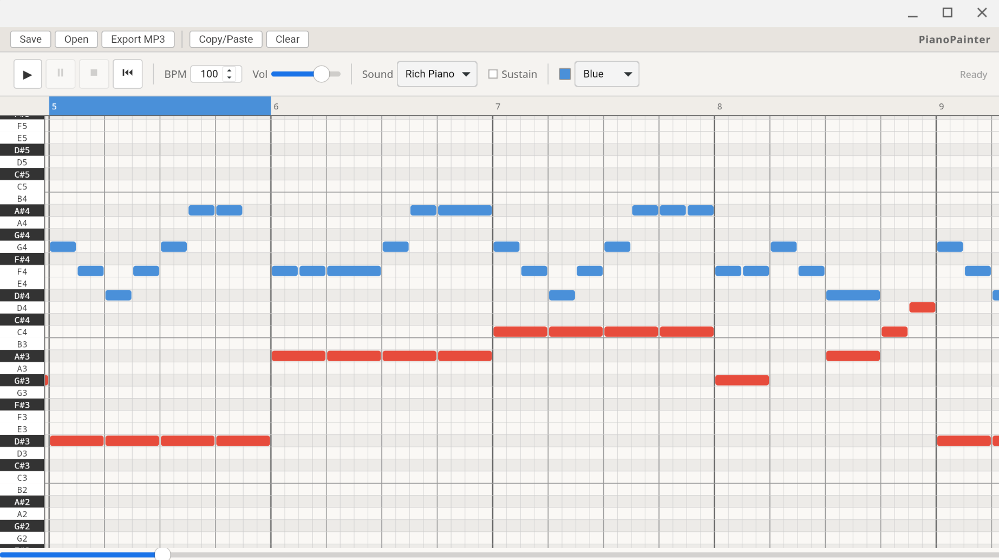

# PianoPainter



A desktop app for composing music by painting notes on a grid. No music degree required.

## The Story

Ever since I was a kid, I wanted to make music but never had the patience to learn an instrument. I always thought -- what if I could just *draw* a song? Click some boxes, hear some notes, move things around until it sounds good?

Every music app I tried was either way too complicated or way too limited. I wanted something in between. Something where I could just open it up, start clicking, and hear a song come together.

So I built PianoPainter.

## What It Does

- **Paint notes on a grid** -- click to place, click to remove, drag right to hold a note longer
- **3 built-in synth engines** -- Basic, FM Piano, and Rich Piano (a multi-oscillator setup that actually sounds pretty decent)
- **Sustain pedal** -- toggle it on and a green bar appears at the bottom. Paint where you want the pedal held down, just like a real piano
- **Color-coded notes** -- assign colors to notes for visual organization (or just because it looks cool)
- **Copy/Paste wizard** -- copy measures and repeat them wherever you want
- **Adjustable BPM and volume**
- **Save/Load** your projects as `.pp` files
- **Export to MP3** -- pre-rendered samples make this reasonably fast
- **Infinite horizontal scrolling** -- your song can be as long as you want
- **Click measure numbers** to set a playback start point

## Download

Pre-built installers for all supported platforms are available on the [Releases page](https://github.com/cartpauj/piano-painter/releases).

Grab the file that matches your system:

- **macOS (Apple Silicon - M1/M2/M3)** -- `PianoPainter_*_aarch64.dmg`
- **macOS (Intel)** -- `PianoPainter_*_x64.dmg`
- **Windows x64** -- `PianoPainter_*_x64_en-US.msi` or `PianoPainter_*_x64-setup.exe`
- **Linux x64** -- `PianoPainter_*_amd64.deb` (Debian/Ubuntu), `PianoPainter-*.x86_64.rpm` (Fedora/RHEL), or `PianoPainter_*_amd64.AppImage` (universal)
- **Linux ARM64** -- `PianoPainter_*_arm64.deb`, `PianoPainter-*.aarch64.rpm`, or `PianoPainter_*_aarch64.AppImage`

> **Note for macOS users:** Since PianoPainter isn't signed with an Apple Developer certificate, macOS will block it from opening. How you fix this depends on your macOS version:
>
> **Older macOS (Monterey and earlier):**
> 1. Try to open the app — you'll see a warning saying it can't be opened because it's from an unidentified developer.
> 2. Open **System Preferences → Security & Privacy → General** tab.
> 3. At the bottom, you'll see a message about PianoPainter being blocked. Click **Open Anyway**.
> 4. Confirm when prompted.
>
> **Newer macOS (Ventura and later, especially Apple Silicon):**
> You may see a message that the app is "damaged and can't be opened" — this is Gatekeeper being overly cautious. To fix it, open Terminal and run:
>
> ```bash
> xattr -d com.apple.quarantine /Applications/PianoPainter.app
> ```
>
> Then open the app normally. You only need to do this once.

> **Note for Linux users:** For `.AppImage` files, you may need to make them executable with `chmod +x PianoPainter_*.AppImage` before running.

## Building It

You'll need:
- [Node.js](https://nodejs.org/) (v18+)
- [Rust](https://www.rust-lang.org/tools/install)
- [pnpm](https://pnpm.io/)
- System dependencies for Tauri -- see [Tauri Prerequisites](https://v2.tauri.app/start/prerequisites/)

```bash
git clone https://github.com/cartpauj/piano-painter.git
cd piano-painter
pnpm install
pnpm tauri dev
```

First build takes a while (Rust compilation). After that, hot reload is fast.

To build a release binary:
```bash
pnpm tauri build
```

## Using It

- **Click** a cell to place a note (you'll hear it preview)
- **Click and drag right** to create a held note
- **Click** an existing note to remove it
- **Scroll wheel** to move up/down through octaves
- **Shift + scroll** or **trackpad swipe** to move left/right through time
- **Space bar** to play/pause
- **Click a measure number** at the top to set where playback starts
- **Stop** resets to the selected measure, **rewind button** goes back to measure 1

## Sample Songs

The `samples/` directory has example project files you can open in the app to see how things work. Give `mary.pp` a try -- it's Mary Had a Little Lamb.

## Pre-rendered Samples

The `src-tauri/resources/samples/` directory contains 366 pre-rendered PCM audio samples -- every note across all 3 synth engines, with and without sustain. These are bundled with the app so MP3 exports are fast out of the box (no rendering needed). If they're missing for some reason, the app will regenerate them on the fly during export.

## Tech Stack

Built with [Tauri 2](https://v2.tauri.app/), [SolidJS](https://www.solidjs.com/), and [Tone.js](https://tonejs.github.io/). The grid is rendered on HTML Canvas for performance. MP3 encoding happens in Rust via mp3lame.

## License

See [LICENSE](LICENSE) for details.
